# 🛒 Ecommerce Laravel

Proyecto de **tienda online desarrollado con Laravel**, donde los usuarios pueden visualizar productos, agregarlos al carrito de compras y administrar un catálogo de productos con imágenes y precios.

Este proyecto fue desarrollado con fines **educativos y de aprendizaje**, aplicando buenas prácticas de desarrollo web con **Laravel, Blade y MySQL**.

---

# 🚀 Características del proyecto

* 📦 Listado de productos
* 🖼 Visualización de productos con imágenes
* 🛒 Agregar productos al carrito
* ✏ Crear productos
* 🔄 Actualizar productos
* ❌ Eliminar productos
* 💰 Precios en pesos colombianos
* 🎨 Diseño moderno con tarjetas de productos
* 📱 Interfaz adaptable (responsive)

---

# 🛠 Tecnologías utilizadas

Este proyecto fue desarrollado con las siguientes tecnologías:

* **PHP**
* **Laravel**
* **Blade (motor de plantillas)**
* **MySQL**
* **HTML5**
* **CSS3**
* **JavaScript**
* **Git**
* **GitHub**

---

# 📂 Estructura del proyecto

```
ecommerce-laravel
│
├── app
│   └── Http
│       └── Controllers
│
├── database
│   └── migrations
│
├── public
│   └── css
│
├── resources
│   └── views
│       ├── products
│       ├── cart
│       └── layouts
│
├── routes
│   └── web.php
│
├── README.md
├── composer.json
└── .env
```

---

# ⚙️ Instalación del proyecto

## 1️⃣ Clonar el repositorio

```bash
$ git remote add origin https://github.com/EutiquioG/ecommerceShopNova.git
```

Entrar al proyecto:

```bash
cd ecommerce-laravel
```

---

## 2️⃣ Instalar dependencias

```bash
composer install
```

---

## 3️⃣ Crear archivo de entorno

```bash
cp .env.example .env
```

---

## 4️⃣ Generar clave de Laravel

```bash
php artisan key:generate
```

---

## 5️⃣ Configurar base de datos

En el archivo `.env` configurar:

```
DB_DATABASE=ecommerce
DB_USERNAME=root
DB_PASSWORD=
```

---

## 6️⃣ Ejecutar migraciones

```bash
php artisan migrate
```

---

## 7️⃣ Ejecutar el servidor

```bash
php artisan serve
```

El proyecto estará disponible en:

```
http://127.0.0.1:8000
```

---

# 🛍 Productos del sistema

El sistema incluye productos como:

* Laptop Gamer ASUS
* Mouse Gamer RGB
* Teclado Mecánico
* Monitor 27 Pulgadas
* Auriculares Gamer
* Silla Gamer
* Disco SSD 1TB
* Webcam HD
* Tablet Android
* Smartphone Pro

Cada producto incluye:

* Nombre
* Descripción
* Precio
* Imagen

---

# 🖼 Funcionalidades principales

### 📦 Gestión de productos

Permite:

* Crear productos
* Editar productos
* Eliminar productos
* Visualizar catálogo

---

### 🛒 Carrito de compras

Los usuarios pueden:

* Agregar productos
* Visualizar el carrito
* Ver el total de compra

---

# 🎨 Diseño

El proyecto utiliza un diseño basado en **cards de productos**, similar a tiendas online modernas como:

* Amazon
* MercadoLibre
* Shopify

Características visuales:

* Tarjetas de producto
* Imágenes dinámicas
* Botones interactivos
* Diseño limpio y moderno

---

# 📸 Capturas del proyecto
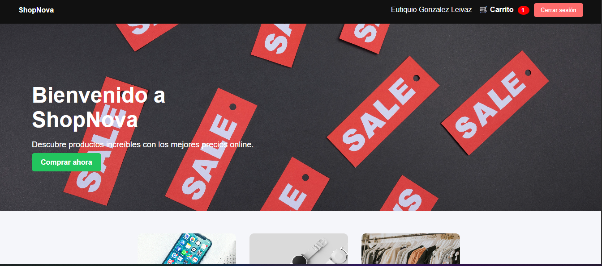
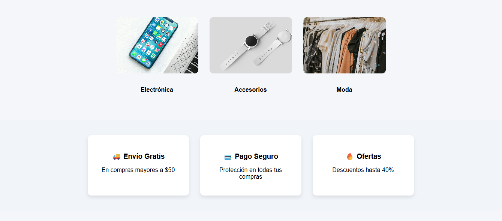
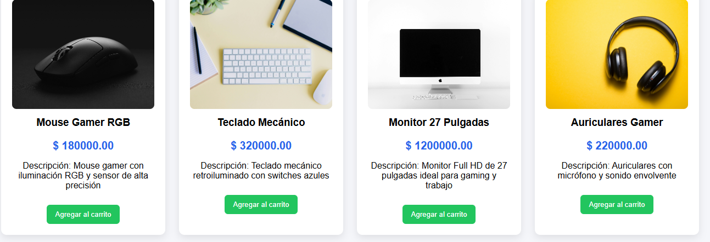
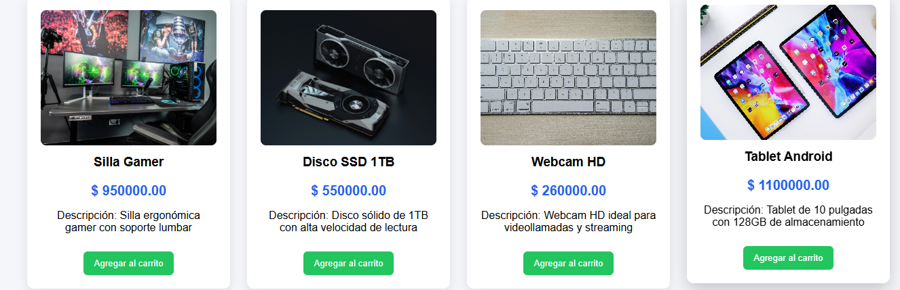
Listado de productos con imágenes y precios.
 
 ### Login y Registro
 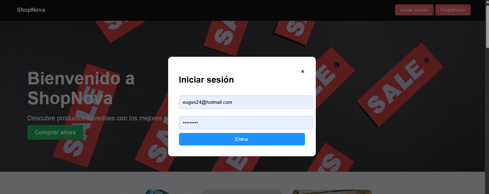
 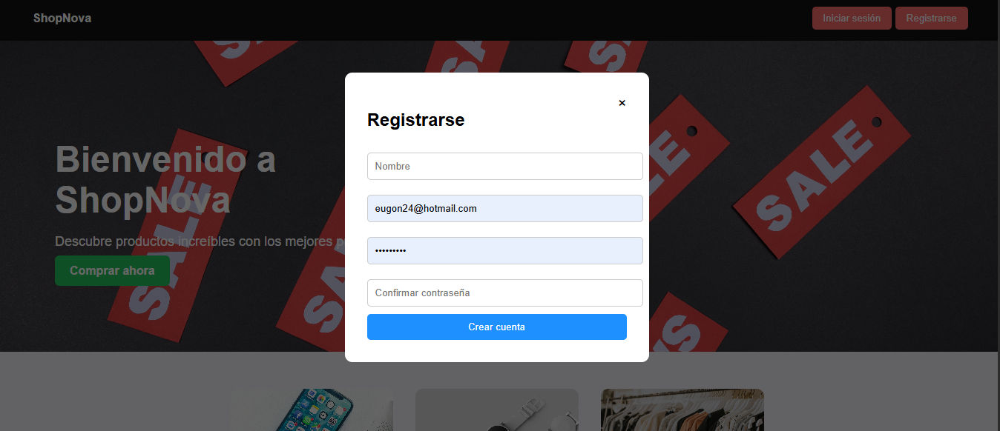

### Carrito de compras
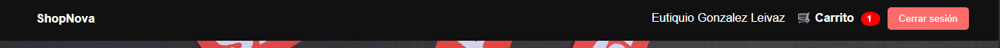
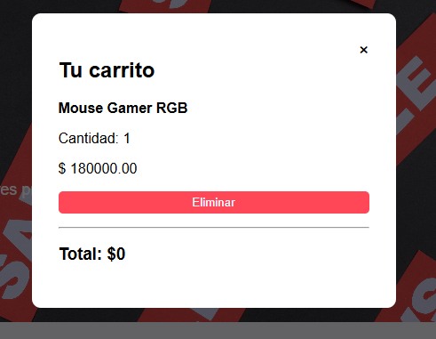

# Panel Administrador
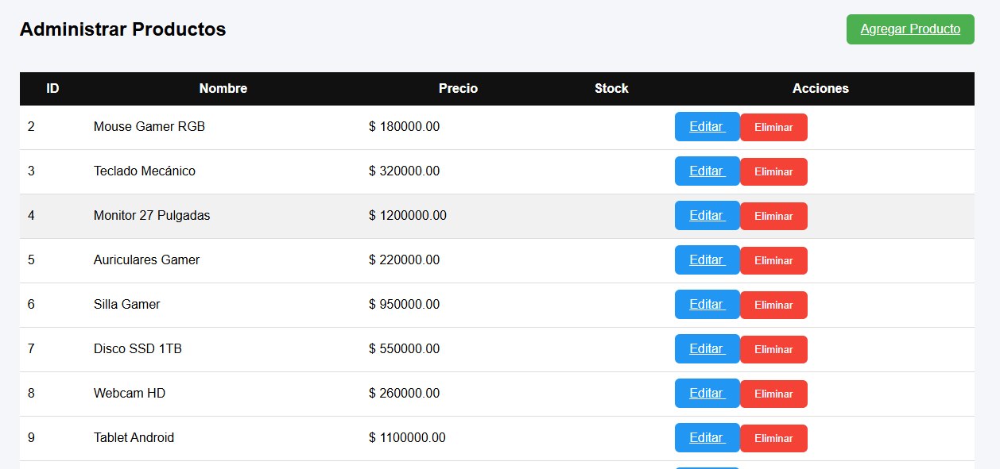
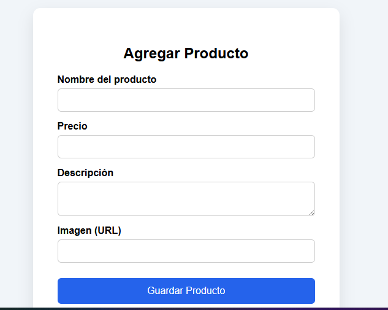
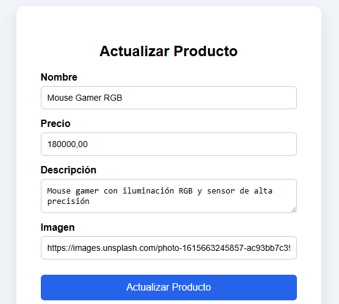


# 👨‍💻 Autor

Proyecto desarrollado por: Eutiquio Gonzalez Leivaz
Desarrollador Web
Proyecto académico de práctica con Laravel.

---

# 📚 Objetivo del proyecto

El objetivo de este proyecto es practicar:

* Desarrollo con **Laravel**
* Manejo de **CRUD**
* Uso de **Blade Templates**
* Integración con **MySQL**
* Uso de **Git y GitHub**

---

# 📄 Licencia

Este proyecto es de **uso educativo y académico**.
